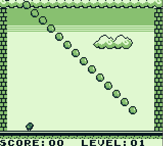

# Gameboy Game
## A Pyoro (Birds and Beans) style game for the Gameboy DMG

Written entirely in Assembly, this is a work in progress game for the original Gameboy, based off of the game Pyoro

The goal of the game is to consume berries falling from the sky before they collide with the ground, destroying it.

## Features

Complete:

- Player movement, jumping and collision
- Extendable tongue to consume berries (beans)
- Breakable floor tiles
- Score UI

In Progress:
- Falling berries based on level
- Berries to restore floor tiles
- Start screen
- Lose condition

Sample gif of current gameplay:

## Build

Requirements:

[RGBDS] - Assembler, Linker and Header patcher for Gameboy

[BGB] - An emulator for testing (any emulator will do, but BGB has great debugging features)

To build, run [make.ps1](make.ps1) after placing RGBDS and BGB into the root directory

This will output a .gb file in the root directory and launch BGB

   [RGBDS]: <https://rgbds.gbdev.io/>
   [BGB]: <https://bgb.bircd.org/>
