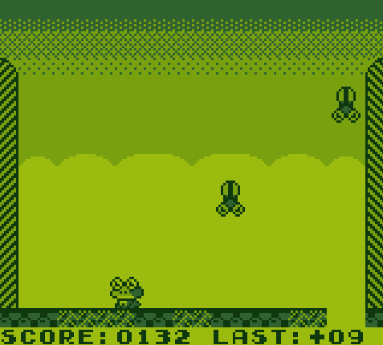

# Gameboy Game

Written entirely in Assembly, this is a work in progress game for the original Gameboy DMG

The goal of the game is to eat flies falling from the sky, before they have a chance to damage the ground beneath your feet

## Features

Complete:

- Player movement, jumping and collision
- Extendable tongue to consume flies
- Sound effects
- Breakable floor tiles
- Difficulty scaling based on score
- Lose condition
- Score UI
- Start screen
- Animation

TODO:
- Items to restore ground tiles/delete flies
- Proper menu screen and title
- Background music
- High Score

Sample gif of current gameplay:

## Build

Requirements:

[RGBDS] - Assembler, Linker and Header patcher for Gameboy

[BGB] - An emulator for testing (any emulator will do, but BGB has great debugging features)

To build, run [make.ps1](make.ps1) after placing RGBDS and BGB into the root directory

This will output a .gb file in the root directory and launch BGB

   [RGBDS]: <https://rgbds.gbdev.io/>
   [BGB]: <https://bgb.bircd.org/>
